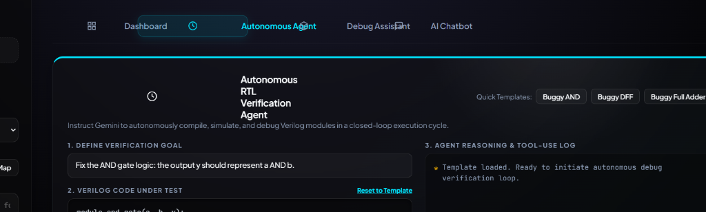

# LogicAgent AI


LogicAgent AI is an advanced, automated waveform verification platform and autonomous RTL synthesis agent. The system combines deterministic Verilog behavioral simulation with a sophisticated Large Language Model (LLM) to iteratively generate, simulate, and formally verify digital logic circuits without requiring external Electronic Design Automation (EDA) toolchains.

The platform is designed to serve as both a diagnostic tool for hardware verification engineers and an autonomous agent capable of closing the loop between RTL specification and testbench validation.

## Core Capabilities

### Autonomous RTL Synthesis & Verification Loop
The core innovation of LogicAgent AI is its autonomous execution loop. When provided with a natural language specification, the built-in AI agent iteratively:
1. **Synthesizes** the target Verilog RTL code.
2. **Executes** a native, deterministic behavioral simulation against a pre-defined testbench template.
3. **Validates** the emitted Value Change Dump (VCD) waveform against strict combinational and sequential assertions.
4. **Self-Corrects** by feeding any verification failures back into the AI context for syntax and logic resolution until the circuit passes all criteria.

### Deterministic Waveform Analysis & Debugging
LogicAgent AI incorporates an interactive diagnostic interface where users can upload existing VCD files. The system runs deterministic backend checks, identifying exact chronological mismatches between expected logic states and the simulated trace. The AI engine can then analyze these specific trace failures and provide granular root-cause analysis.

### Multi-Checker Verification Engine
The backend engine leverages a strict, logic-state evaluator to assert correctness across standard digital blocks:
- **Combinational Logic Templates**: Supports immediate state assertion for `AND`, `OR`, `XOR`, `NAND`, `NOR`, `XNOR`, `HALF_ADDER`, `FULL_ADDER`, and `MUX2` logic gates.
- **Sequential Logic Templates**: Supports time-series behavioral verification for `DFF`, `T_FF`, `JK_FF`, and `COUNTER` structures, successfully modeling edge-triggered clock transitions, resets, and toggles.

### Zero-Dependency Python RTL Simulator
The platform features a proprietary, lightweight Verilog behavioral simulator (`sim_engine.py`) written entirely in native Python. This parser can evaluate continuous assignments (`assign`), sequential edge-triggered blocks (`always @(posedge clk)`), and conditional logic, emitting standard IEEE 1364 VCD traces directly into memory.

### Hierarchical Signal Resolution
To ensure interoperability with standard industry tools like Xilinx Vivado and ModelSim, the verification engine automatically resolves complex hierarchical signal paths (e.g., matching a user-defined `clk` to `tb/dut/clk` or `tb.dut.clk`).

## Installation & Deployment

### Automated Deployment (Windows)
The repository includes an automation script (`run.bat`) for immediate environment deployment:
1. Execute `run.bat`.
2. The script will initialize the environment, resolve required Python dependencies (`flask`, `google-genai`), and request your API key to bootstrap the AI endpoints.
3. The server runs locally and launches the graphical interface in your default browser.

### Manual Installation
To deploy the backend API and frontend client manually:

```bash
# Install required backend dependencies
pip install flask google-genai

# Initialize the Flask WSGI server
python app.py
```
Access the client dashboard at: `http://127.0.0.1:5000/`

## System Architecture

The project is structured into discrete, decoupled micro-components:

### Backend Architecture
- **`app.py`**: The Flask application layer handling HTTP REST requests and Server-Sent Events (SSE) for asynchronous telemetry.
- **`backend/agent_engine.py`**: The autonomous controller orchestrating the LLM tool-calling loop, simulator execution, and state rollback mechanisms.
- **`backend/smart_engine.py`**: The AI integration layer managing chat context windows and contextual error explanations.
- **`backend/sim_engine.py`**: The deterministic behavioral Verilog parser and in-memory execution engine.
- **`backend/verifier.py`**: The assertion evaluation engine that processes structured VCD state transitions.
- **`backend/vcd_parser.py`**: A robust regex-based parser that deserializes IEEE standard VCD files into Python dictionaries.

### Frontend Architecture
- **`index.html`**: The unified Single Page Application (SPA) shell utilizing a modular, tab-based layout.
- **`static/js/app.js`**: Client-side logic for waveform rendering, DOM manipulation, state management, and continuous SSE stream consumption from the agent backend.
- **`static/css/styles.css`**: A highly responsive, modern stylesheet leveraging CSS variables, grid layouts, and hardware-accelerated micro-animations.
